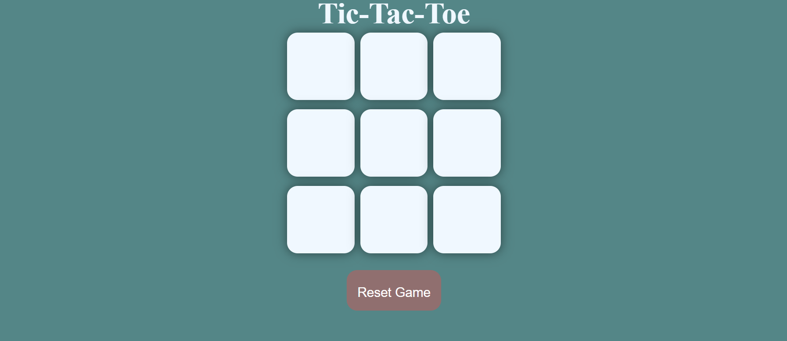
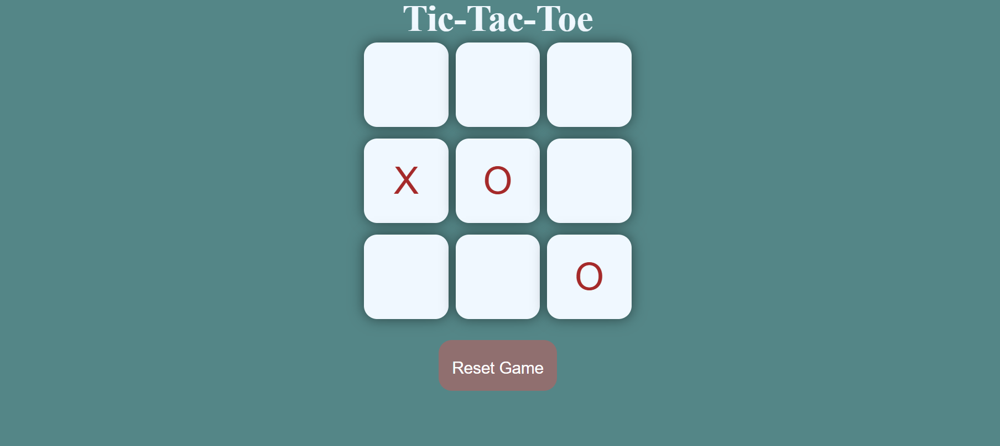
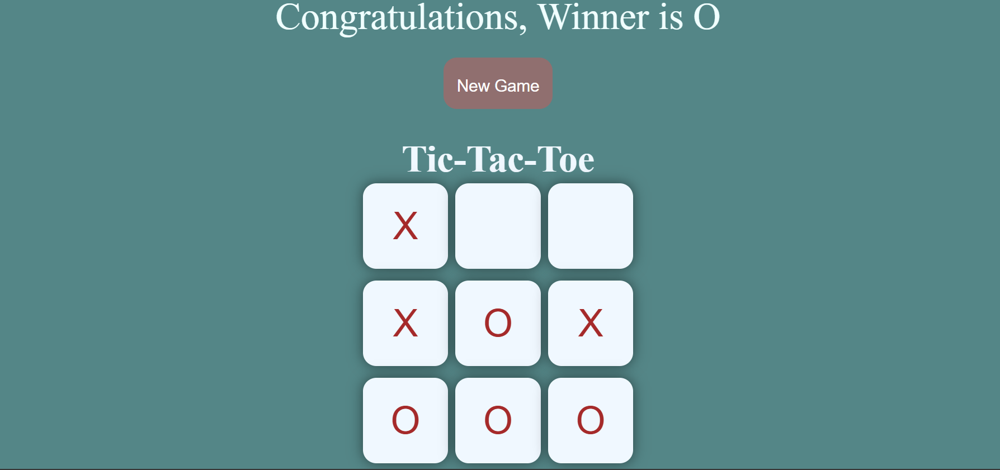

# 🕹️ Tic-Tac-Toe Game

A simple and responsive Tic-Tac-Toe game built using HTML, CSS, and JavaScript. This classic 2-player game lets players take turns marking spaces in a 3×3 grid. The first to align three of their symbols (X or O) horizontally, vertically, or diagonally wins.

---
## OnGoing Game 

## Winning Game

## 🔧 Technologies Used

- **HTML5** – for the game structure  
- **CSS3** – for styling and responsive layout  
- **JavaScript** – for game logic and interactivity  

---

## 🎮 Features

- 3×3 game board with turn-based logic  
- Player turn switching between X and O  
- Win condition check (rows, columns, diagonals)  
- Display winning message  
- "Reset Game" button to clear the board  
- "New Game" button to restart a fresh game  
- Responsive design for mobile and desktop  

---
